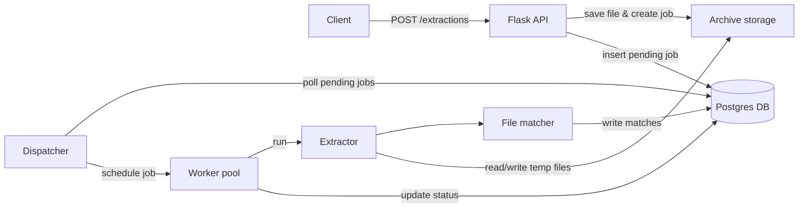
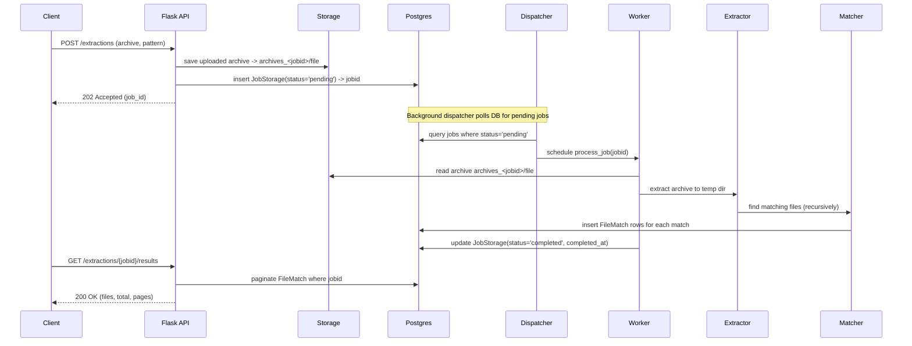

# Architecture Overview

This document describes the runtime architecture of the Archive Extraction Service. The diagrams below show the system components and a typical job processing sequence.

## Component diagram

## Sequence diagram (typical job)

## Notes

- Diagrams are logical; `Storage` may be local disk (`archives_<jobid>`) or an external object store depending on deployment.
- `Dispatcher` is an in-process background component that schedules `process_job()` on a worker pool.

## Component explanations

- **Client**: Any HTTP client (curl, Postman, or internal service) that uploads archives and requests job status/results.
- **Flask API**: The HTTP layer (`app.py`, `routes.py`) that accepts requests, validates input, saves uploaded files to storage, and inserts a `JobStorage` record with `pending` status into the database.
- **Archive storage**: Where uploaded archives are saved (implementation: `archives_<jobid>` on local filesystem). Used by workers to read the archive for extraction. Can be swapped for S3 or other object stores in production.
- **Postgres DB**: Stores job metadata (`JobStorage`) and matched-file records (`FileMatch`). The dispatcher and workers read/write job state and file matches here.
- **Dispatcher**: Background component that periodically polls the DB for `pending` jobs and schedules them onto the worker pool. Controls concurrency via `POOL_SIZE`.
- **Worker pool**: A bounded pool of workers (threads in current implementation) that execute `process_job()` for each job; each worker handles extraction, matching, DB writes, and status updates.
- **Extractor**: Extraction logic (`extract_archive`, `extract_and_find`) that unpacks archives into temporary directories, detects nested archives, and delegates nested extraction.
- **Matcher**: File-matching logic that applies glob patterns (via `glob`) to extracted file trees and constructs `FileMatch` metadata for DB insertion.

## Sequence diagram step explanations

1. Client → Flask API: POST /extractions (archive, pattern)
  - The client submits an archive file and a glob `pattern` (e.g., `**/*.json`) as `multipart/form-data`.

2. Flask API → Storage: save uploaded archive → archives_<jobid>/file
  - API saves the uploaded file to a stable location associated with the new job id. This is the source used by workers for extraction.

3. Flask API → Postgres DB: insert JobStorage(status='pending') → jobid
  - API creates a `JobStorage` record with `status='pending'`, `archivename`, `pattern`, and `submitted_at`. The generated `jobid` is returned to the client.

4. Flask API → Client: 202 Accepted (job_id)
  - The API returns immediately with `202 Accepted` and the `job_id`, confirming asynchronous processing.

5. Dispatcher polls DB for pending jobs
  - A background dispatcher loop queries the DB for jobs with `status='pending'` and selects up to `POOL_SIZE` jobs to schedule.

6. Dispatcher → Worker: schedule process_job(jobid)
  - Dispatcher updates job status to `running` and submits `process_job(jobid)` to the worker pool.

7. Worker → Storage: read archive archives_<jobid>/file
  - The worker reads the saved archive file from storage to begin extraction.

8. Worker → Extractor: extract archive to temp dir
  - The extractor unpacks the archive into a temporary directory, using `zipfile` or `py7zr`. For nested archives, the extractor recurses with a safety depth limit.

9. Extractor → Matcher: find matching files (recursively)
  - The matcher scans the extracted tree with the provided glob pattern, skipping nested archives for separate recursive handling, and collects file metadata (path, size, nesting depth).

10. Matcher → Postgres DB: insert FileMatch rows for each match
   - For each matched file, worker inserts rows into `FileMatch` with the full logical path (including nesting chain), filename, filesize, nesting depth, `extracted_at`, and `source_archive`.

11. Worker → Postgres DB: update JobStorage(status='completed', completed_at)
   - After processing, the worker updates the job row to `completed` and writes `completed_at` (or `failed` with `error` on exceptions).

12. Client → Flask API: GET /extractions/{jobid}/results
   - Client queries the API for paginated matched file results.

13. Flask API → Postgres DB: paginate FileMatch where jobid
   - The API reads `FileMatch` rows for the `jobid` with the requested `page` and `per_page` parameters and returns paginated results.

14. Flask API → Client: 200 OK (files, total, pages)
   - The API returns a JSON payload with matched file paths and pagination metadata.

These explanations map each diagram arrow to a concise operational step to aid readers in understanding system behavior and responsibilities.
