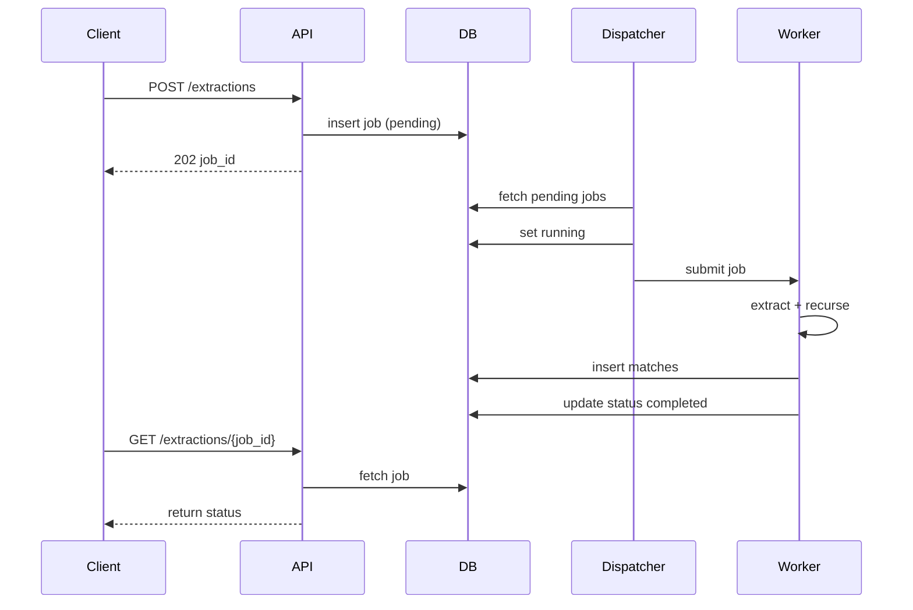
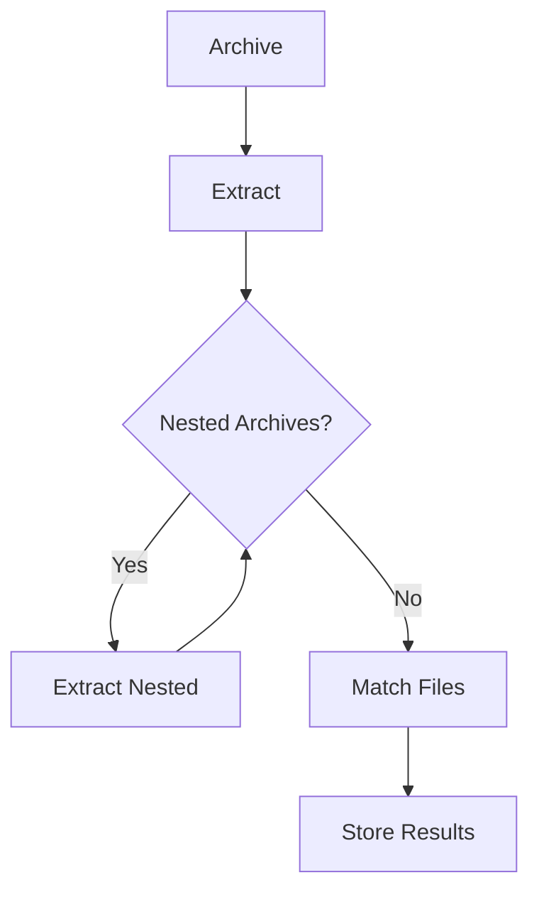
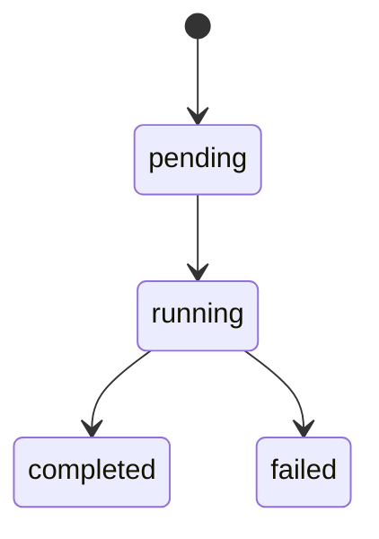

# Architecture - Archive Extractor Service

---

## 1. Overview

This service processes archive extraction jobs asynchronously. It accepts an archive and a file pattern, recursively extracts nested archives, finds matching files, and stores results in a database.

---

## 2. High-Level Architecture

```mermaid
graph TD
    A[Client] --> B[Flask API]
    B --> C[Database (JobStorage & FileMatch)]
    C --> D[Job Dispatcher (Polling Loop)]
    D --> E[ThreadPoolExecutor]
    E --> F[process_job Worker]
    F --> G[Recursive Extraction]
    G --> H[File Matching]
    H --> I[Store Results in DB]
    I --> C
    C --> B
```

### Explanation

1. Client sends request to API
2. API stores job in database
3. Dispatcher polls DB for pending jobs
4. Jobs are executed via ThreadPoolExecutor
5. Worker processes job
6. Extract files and match patterns
7. Store results in DB
8. Client retrieves results

---

## 3. Components

### Flask API
- Handles HTTP requests
- Validates input
- Inserts jobs into database

### Database

#### JobStorage
- jobid
- status
- submitted_at
- completed_at
- error

#### FileMatch
- jobid
- filepath
- filename
- filesize
- nesting_depth
- source_archive

### Job Dispatcher
- Polls database continuously
- Picks jobs with status = pending
- Updates status to running

### ThreadPoolExecutor
- Executes jobs concurrently
- Controlled by pool size

### Worker (process_job)
- Extract archive
- Recursively process nested archives
- Store matched files
- Update job status

---

## 4. Sequence Diagram



### Sequence Diagram Explanation

#### 1. Client Submits Job
- Client sends POST /extractions request
- Includes archive and pattern

#### 2. API Stores Job
- Job inserted into DB with status = pending

#### 3. Response Returned
- API immediately returns job_id
- Processing is asynchronous

#### 4. Dispatcher Picks Job
- Dispatcher finds pending job
- Updates status to running

#### 5. Worker Execution
- Worker starts processing job
- Extracts archive and nested archives

#### 6. File Matching
- Applies pattern matching on extracted files

#### 7. Store Results
- Matching files are stored in DB

#### 8. Job Completion
- Status updated to completed or failed

#### 9. Client Polls Status
- Client calls GET endpoint
- Retrieves job status and results

---

## 5. Extraction Flow



---

## 6. Concurrency Design

- ThreadPoolExecutor handles parallel job execution
- Dispatcher ensures controlled job scheduling
- Designed for I/O-bound operations

---

## 7. Job Lifecycle



---

## 8. Key Design Decisions

- Database-driven job queue
- Dispatcher loop for controlled execution
- Recursive archive extraction
- Thread-based concurrency

---

## 9. Limitations

- Polling-based dispatcher
- No distributed workers
- No authentication

---

## 10. Future Improvements

- Replace polling with queue system
- Add distributed workers
- Add authentication
- Improve performance for large archives
